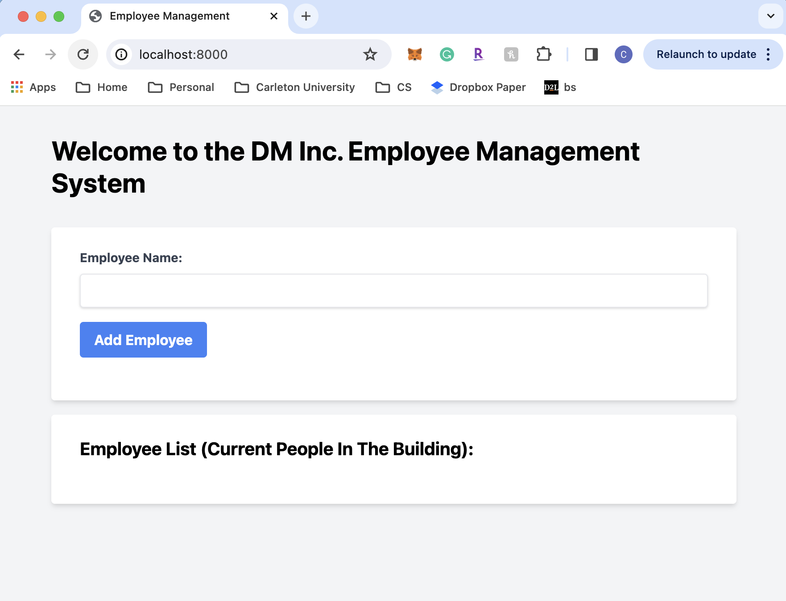
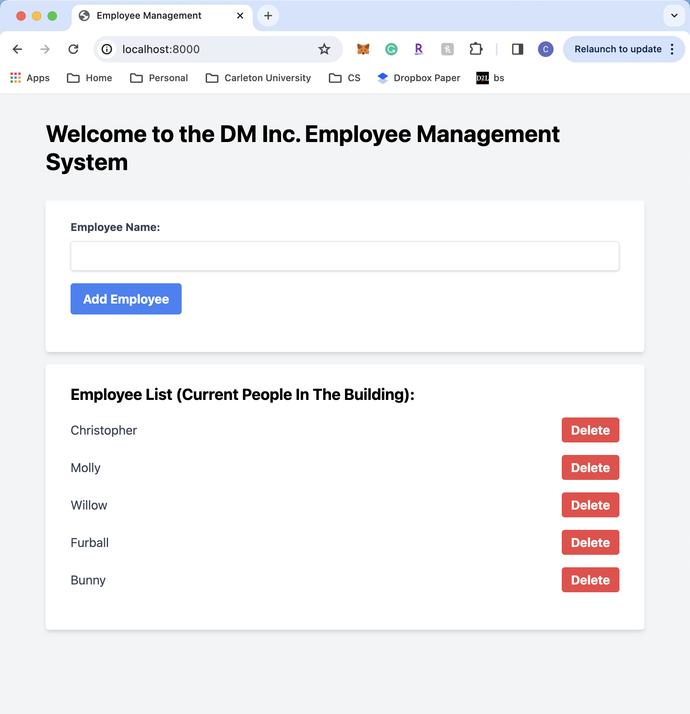

# QRCodeAttendanceSystem

## Laravel MVC QR Code Attendance System

### Introduction

This application leverages the power of Laravel, a robust PHP framework, and the Model-View-Controller (MVC) architectural pattern to create an efficient and user-friendly QR Code-based attendance system. The primary goal of this system is to manage access to a building and maintain an accurate list of individuals present at any given time.

### Features

- **QR Code Generation**: Unique QR codes are generated every day at midnight.
- **Real-Time Attendance Tracking**: The system records entries and exits, updating the attendance list in real time.
- **Secure Authentication**: Built on Laravel's robust authentication mechanisms to ensure data security.
- **User Management**: Admins can add, remove, or edit user profiles and access privileges.
- **Responsive Design**: Accessible via multiple devices, optimized for both desktop and mobile usage.
- **QR Code Poster Generation**: A QR code poster is automatically generated and updated every midnight for posting in the building.

### Usage

Detailed instructions on how to use the application will be provided, covering aspects such as:

### 1. Scanning QR codes at the entrance. (Leads to website)

### 2. Functionalities for managing user access.

### 3. Viewing and interpreting attendance data. With ability to delete names when leaving the building

